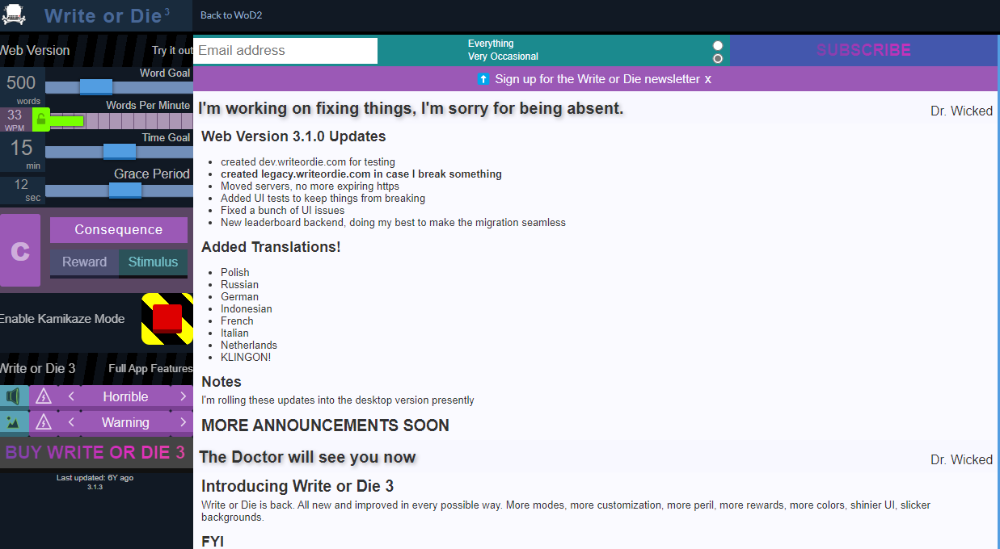

# Nudge Writing App

### Problem Statement
Unfortunately for the writer-procrastinators of the world, the best antidote for writer's block is usually exactly what we find the most difficult: writing, writing, and more writing.  One tool that I've found instrumental in getting over a slump (that made it possible for me to participate in NaNoWriMo last November) is the aptly named Write or Die, which forces the user to choose a time, minimum wordcount, and a 'consequence' - this can mean alarms being sounded or your writing being deleted, among others.  Basically if you stop writing, you face the consequence. Sadly, however, the app and website haven't seen updates in about 6 years. While some features are still technically functional,  the goal of my web application is to resurrect those parts that haven't survived the test of time, and combine them with additional productivity and statistical features to encourage the writing habit!

The screenshot below was taken from the current Write or Die website:

### Project Technologies/Techniques 

* Security/Authentication
  * AWS Cognito
* Database
  * MySQL 8.x
* ORM Framework
  * Hibernate Version TBD
* Dependency Management
  * Maven
* Web Services consumed using Java
  * TBD (AI story prompts?)
  * Calendso or line chart web service?
* CSS 
  * Bootstrap or Materialize 
* Data Validation
  * Bootstrap Validator for front end
  * Explore Hibernate Validator?
* Logging
  * Log4J2
* Hosting
  * AWS
* Tech I'd like to explore as part of this work
  * TBD
* Project Lombok
* Unit Testing
  * JUnit tests to cover all testable logic
* IDE: IntelliJ IDEA

### Design

* [User Stories](AppDesign/userStories.md)
* [Screen Design](AppDesign/Screens.md)

### [Project Plan](ProjectPlan.md)

#### [TimeLog Journal](timeLog.md)
